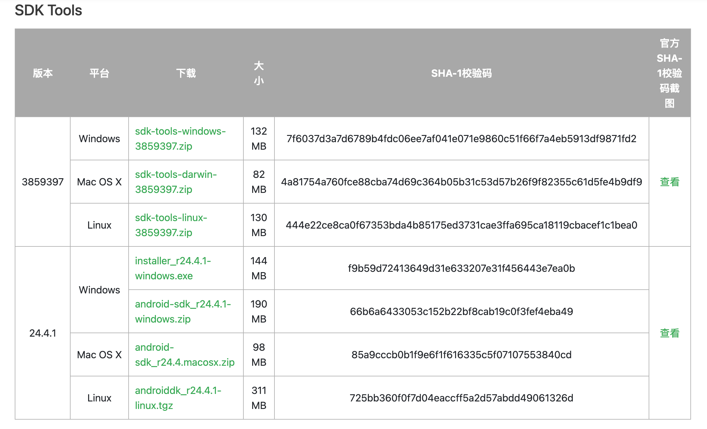
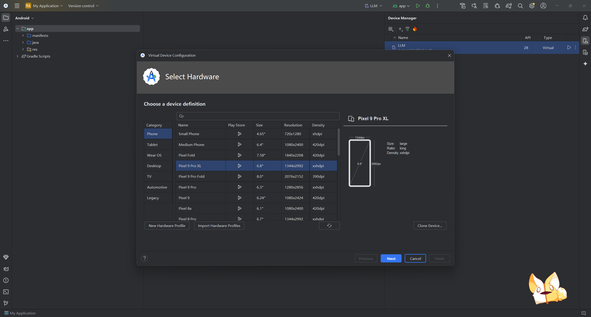
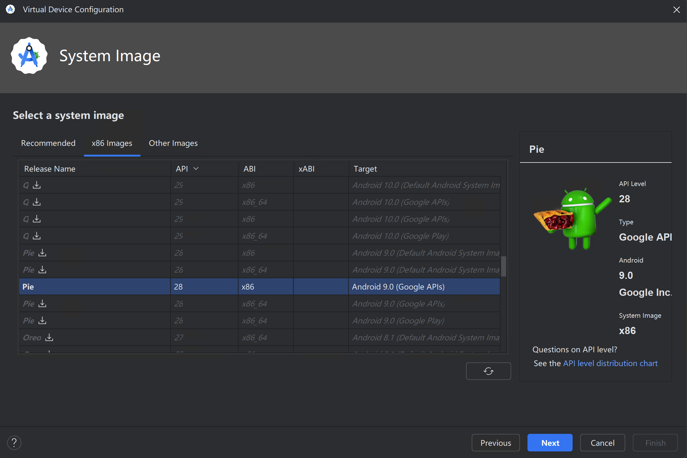
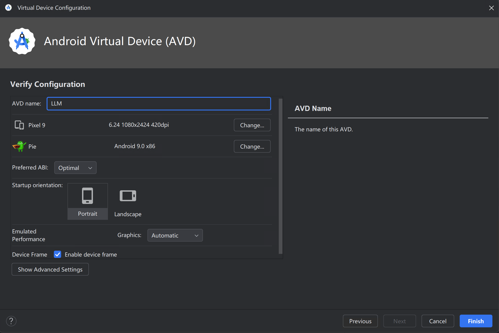
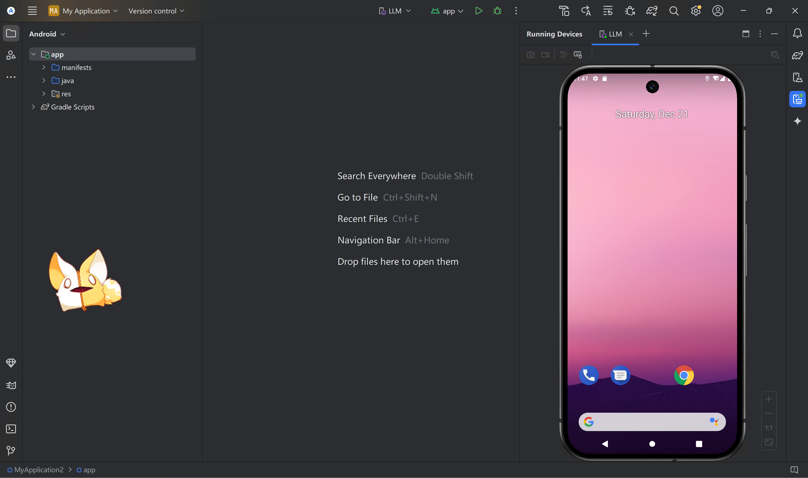

# GUI_testing_with_LLM

### 项目描述


### 项目运行

#### 运行要求

- pyhton版本大于等于3.10
- 内存大于等于16G
- 配置并安装ADB
- 手机虚拟机可正常连接
- python库正常安装
- OpenAI Key可正常使用

#### 安装 Android Studio

- [下载地址](#https://developer.android.com/studio?hl=zh-cn)

#### 配置Android SDK

- 下载Android SDK

  [Android SDK下载网址](https://www.androiddevtools.cn/) 

- 安装Android SDK

  

- 配置环境变量

  1. 新建系统环境变量

     ```
     变量名：ANDROID_HOME
     变量值：[Android SDK的路径]
     ```

  2. 系统Path变量添加三个变量

     ```
     %ANDROID_HOME%\platform-tools
     %ANDROID_HOME%\build-tools\[自己的sdk版本]
     %ANDROID_HOME%\tools
     ```

#### 配置手机虚拟机

- 选择机型[Pixel 9 Pro XL]

  

- 选择版本[x86 Pie]

  

- 配置名称[LLM]

  

- 启动虚拟机

  

#### 安装项目依赖

```
$ git clone https://github.com/AIpacino-2001/GUI_testing_with_LLM.git
$ cd droidbot
$ pip install -e . # 安装droidbot
$ cd ..
$ pip install -r requirements.txt # 安装依赖
$ pip install -e . # 安装droidagent
```

#### OpenAI-Key

在/droidagent/env下配置：

```
OPENAI_API_KEY = [自己的OpenAI-Key]
```

#### 运行项目

