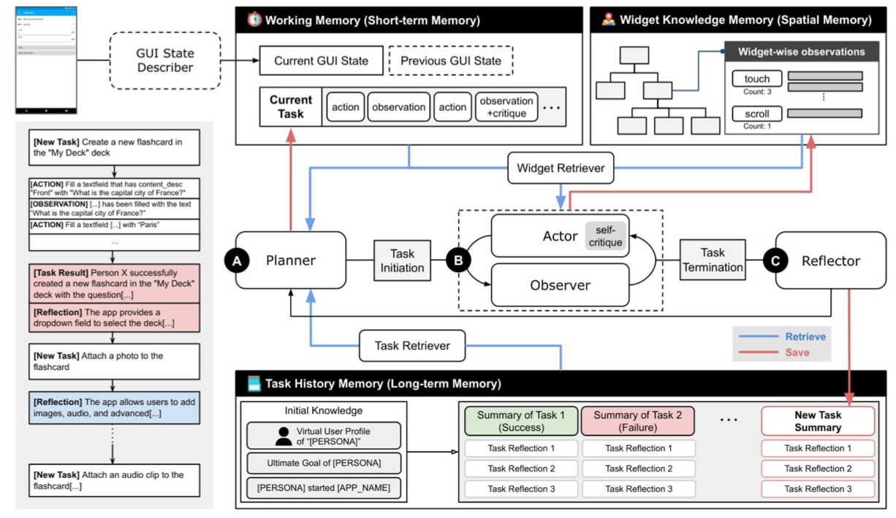
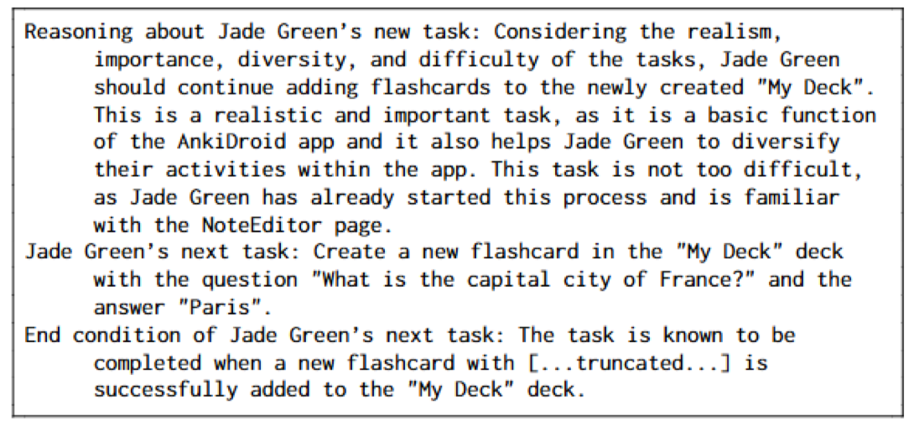
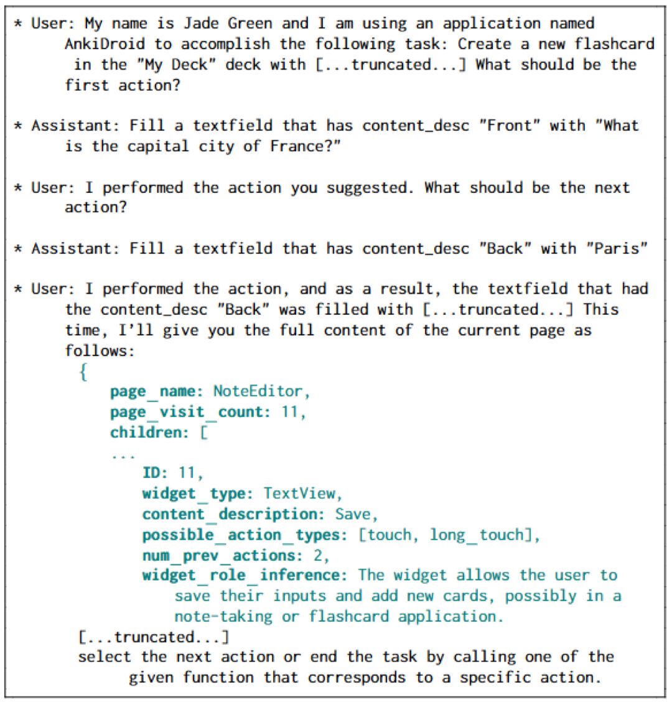
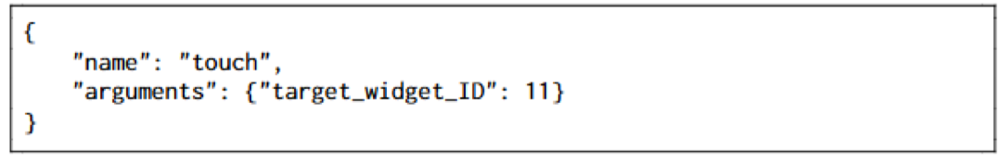
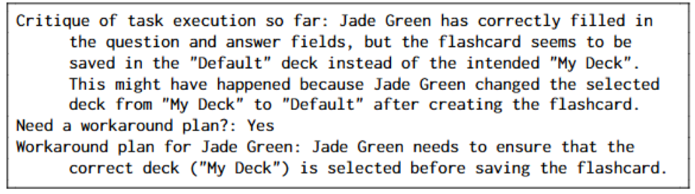
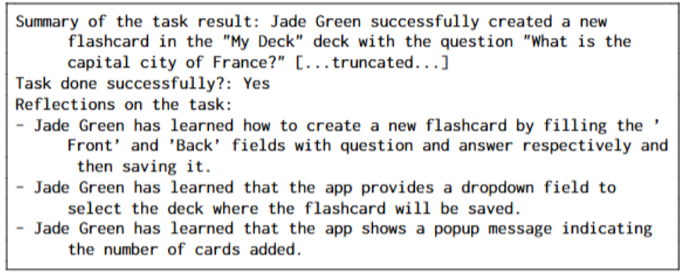

# GUI_testing_with_LLM

## 项目描述

本项目将LLM应用于GUI测试，主要分为4个模块：Planner, Actor, Observer, Reflector.
同时有3种记忆模块：short, long, and spatial
和2种记忆检索模块



### Planner

任务应是**在当前测试状态**下人类接下来想要实现的那些事情。

#### Planner数据的来源

1. 高层次的历史任务数据：规划器获取的**不是**图形用户界面行动的历史。而是最近 N 个（在我们的实验中为 20 个）任务的文本摘要以及 M 个（在我们的实验中为 5 个）最相关任务知识。其中历史信息由`Reflector`插入长期记忆，然后由`检索器`检索和组装。
2. 已访问的和总的activity：在spatial记忆中维护每个activity被访问的次数，部件检索器（Widget）有已覆盖 / 未覆盖活动的列表。以此获得所有活动和当前活动（activity）的信息。
3. 初始知识（Initial knowledge）：即代码中的persona的内容。主要包含角色和其最终目标，在代码中可以通过--goal "xxxx"来指定一个最终目标。项目中的默认目标是`访问尽可能多的页面并尝试其核心功能`

在planner的prompt设计上，作者有以下的考虑：
多样性（任务应覆盖新功能）、现实主义（任务应在应用上可行）、难度（任务应在固定行动长度限制内可行）和重要性（应优先考虑使用应用核心和基本功能的任务）。

### Actor

Actor的作用是得到我下一步应该具体干什么，点击什么东西。

Actor和Observer都会访问`短期工作记忆`（短期工作记忆存储当前任务的执行历史，并在每个规划步骤后清除，以记录新规划的任务）并将action和观察结果记录在短期工作记忆中。

除了上述的历史记录之外。每一步，Actor都会获取到一组定义好的`actions`和`当前屏幕的控件列表`。Actor会选择一个合适的action和控件（如“点击”和“登录按钮”）

上面说的是`显式`的动作，Actor还定义了一些隐式的动作，例如等待时间，返回，结束任务

为了避免Actor出错，作者定期（默认每3个action）根据到那时为止的任务执行历史和当前图形用户界面状态描述生成反馈

### Observer

Observer的作用是当Actor对当前activity做出改变后，将老的和新的activity状态获取出来给到LLM

### Reflector

一轮任务结束以后（Actor指明任务结束/达到最大限制),Reflector就会得出总结:包括Actor的自我批评和来自工作记忆的所有观察结果、当前图形用户界面状态以及最终目标

### 任务检索器

从长期记忆（包含已执行任务的历史，即特定任务的知识以及对任务成功与否的反思）中获得知识

### 部件检索器

从spatial memory（为每个部件分配一个签名，其中包含它所在的活动、资源 ID、内容描述和文本等文本属性）中获取知识。

### 一个例子

Jade想要通过Ankidroid这个app完成““创建新记忆卡片”的任务

#### planner

根据goal目标，planner将会生成一个计划，这个计划包括`推理步骤、建议任务和任务结束条件`三个部分：

#### Actor

规划完总体任务之后，通过虚拟对话的方式一步步获取action。例如当前的背景是已经填好了卡片信息，应当点击保存按钮了，于是有如下对话：

LLM对于User的回答是：



可以看到User提供了意图intent，部件背景，这部分是由Observer提供的。
而LLM从中选择了要点击的部件id

之后还会对自己的行为进行纠正：


#### Reflector

actor做完后，reflector会做总结



## 项目配置

### 运行要求

- pyhton版本大于等于3.10
- 内存大于等于16G
- 配置并安装ADB
- 手机虚拟机可正常连接
- python库正常安装
- OpenAI Key可正常使用

### 安装 Android Studio

- [下载地址](#https://developer.android.com/studio?hl=zh-cn)

### 配置Android SDK

- 下载Android SDK

  [Android SDK下载网址](https://www.androiddevtools.cn/) 

- 安装Android SDK

  

- 配置环境变量

  1. 新建系统环境变量

     ```
     变量名：ANDROID_HOME
     变量值：[Android SDK的路径]
     ```

  2. 系统Path变量添加三个变量

     ```
     %ANDROID_HOME%\platform-tools
     %ANDROID_HOME%\build-tools\[自己的sdk版本]
     %ANDROID_HOME%\tools
     ```

### 配置手机虚拟机

- 选择机型[Pixel 9 Pro XL]

  

- 选择版本[x86 Pie]

  

- 配置名称[LLM]

  

- 启动虚拟机

  

### 安装项目依赖

```
$ git clone https://github.com/AIpacino-2001/GUI_testing_with_LLM.git
$ cd droidbot
$ pip install -e . # 安装droidbot
$ cd ..
$ pip install -r requirements.txt # 安装依赖
$ pip install -e . # 安装droidagent
```

### API-Key

在/droidagent/env下配置：

```
OPENAI_API_KEY = [自己的API-Key]
ps:这里使用的key是小爱API，项目中附带的key余额还有0.86元，可从淘宝购买
```

### 待测试APP

将待测试APP放置在下述文件夹下

```
/GUI_testing_with_LLM/target_apps/
```

### APP账号信息

用于APP的登录，该账号的信息存储于下述文件中

```
/GUI_testing_with_LLM/esources/personas/[xxx].txt
```


## 项目运行

```
$ cd scripts
$ python runDroid.py --app [APP_NAME] --output_dir [OUTPUT_DIR] --goal[GOAL]
```

其中：

```
[APP_NAME]：待测试apk的文件名
[OUTPUT_DIR]：测试输出路径
[GOAL]：测试软件的目标
```

